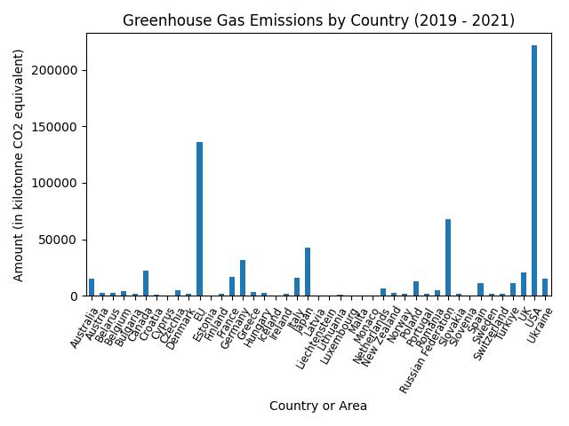
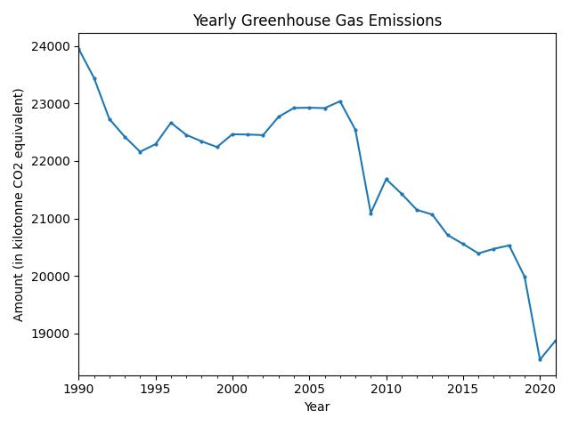
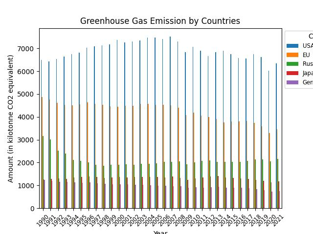
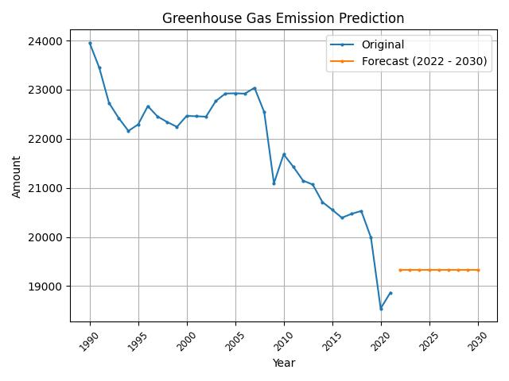

# Results

## Emissions by Country

The bar plot generated shows the total greenhouse gas emissions for each country from 2019 to 2021. Key observations 
include:
- **Top Emitting Countries**: Countries with the highest emissions are identified.
- **Regional Contributions**: Differences in emissions contributions across regions are evident.

## Yearly Emissions

The line plot illustrates the trend of total greenhouse gas emissions over the years. Key findings include:
- **Emissions Trend**: Analysis of whether emissions are increasing, decreasing, or stable over time.
- **Significant Changes**: Identification of years with notable changes in emission levels.

## Yearly Emissions by Country

The bar plot visualizes the emissions from the top countries over different years. Key insights include:
- **Top Performers**: The countries with the highest emissions each year.
- **Yearly Changes**: How emissions have varied year-by-year for these top countries.

## Forecasting Future Emissions

The forecast plot predicts greenhouse gas emissions for the years 2022 to 2030. Key observations include:
- **Predicted Trends**: The forecasted trend and its alignment with historical data.
- **Future Projections**: The projected emissions levels and any identified trends.

## Summary

The analysis provided a comprehensive view of greenhouse gas emissions by country and year. It also included a predictive 
model to forecast future emissions, offering valuable insights for environmental policy and planning.
